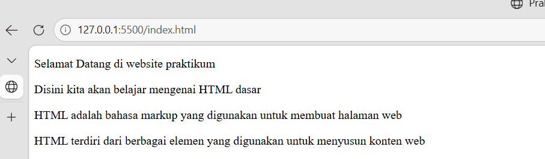
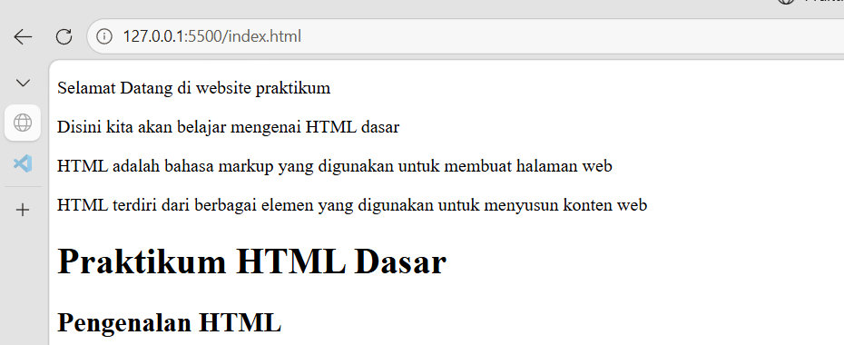
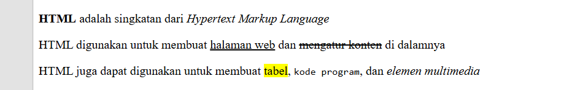
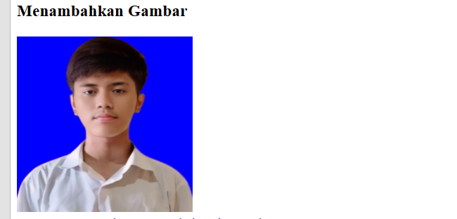
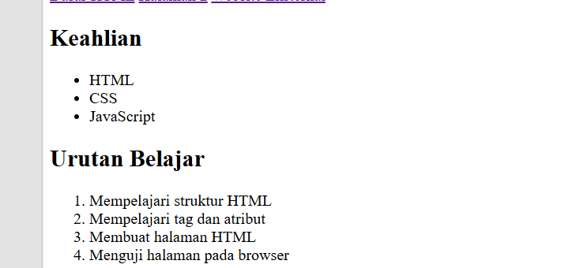
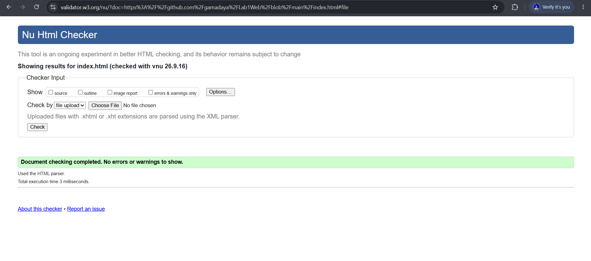

# Dokumentasi Praktikum Web: Fundamental HTML

**Identitas Mahasiswa:**
- **Nama:** Gama Daya Laksana
- **NIM:** 312510051
- **Kelas:** I253A
- **Program Studi:** Teknik Informatika
- **Dosen Pengampu:** Agung Nugroho, S.Kom., M.Kom.
- **Kampus:** Universitas Pelita Bangsa

## Panduan Screenshot Tugas

Simpan semua file tangkapan layar (screenshot) di dalam folder `screenshots/` dengan format nama angka (`1.png` sampai `8.png`) sesuai tabel berikut:

| No File | Aplikasi / Lokasi | Yang Harus Di-Screenshot |
|---|---|---|
| **`ss1.png`** | Browser | Tampilan Paragraf dan Penataan Teks`<p>` di browser. |
| **`ss2.png`** | Browser | Tampilan heading `<h1>`, `<h2>` di browser. |
| **`ss3.png`** | Browser | Tampilan hasil pemformatan teks (`<b>`, `<i>`, `<mark>`, `<u>`, `<mark>`, `<s>`, `<em>`,`<code>`). |
| **`ss4.png`** | Browser | Tampilan gambar foto profil mahasiswa (`images/profil.jpg`) dengan lebar 200px. |
| **`ss5.png`** | Browser | Tampilan file `halaman2.html` yang menunjukkan navigasi link dan anchor link. |
| **`ss6.png`** | Browser | Tampilan Unordered List (`<ul>` keahlian) dan Ordered List (`<ol>` target belajar). |
| **`ss7.png`** | Browser ([validator.w3.org](http://validator.w3.org)) | Hasil validasi W3C yang menunjukkan halaman bebas error (hijau). |

---

## Struktur Folder

```text
Lab1Web/
├── index.html
├── halaman2.html
├── images/
│   └── profil.jpg
├── screenshots/
│   ├── ss1.png
│   ├── ss2.png
│   ├── ss3.png
│   ├── ss4.png
│   ├── ss5.png
│   ├── ss6.png
│   ├── ss7.png
└── README.md
```

---

## Pendahuluan

**HTML (HyperText Markup Language)** adalah bahasa markah standar yang menjadi fondasi utama dari setiap halaman web di internet. HTML bukanlah sebuah bahasa pemrograman yang memiliki logika matematis, melainkan sebuah instrumen yang digunakan untuk mendeskripsikan dan menstrukturkan konten di dalam ruang digital.

Jika diibaratkan sebagai sebuah bangunan, HTML adalah kerangka atau struktur fondasi dari bangunan tersebut. HTML bekerja dengan menggunakan sistem **Tag** dan **Atribut** untuk memberi tahu *web browser* (seperti Chrome, Firefox, atau Safari) bagaimana cara merender atau menampilkan teks, gambar, tautan, dan elemen multimedia lainnya kepada pengguna secara visual dan semantik.

Dokumentasi ini disusun sebagai laporan praktikum untuk mendemonstrasikan pemahaman mengenai elemen-elemen fundamental penyusun halaman web.

## Implementasi Kode & Dokumentasi

Berikut adalah pembedahan dari setiap elemen HTML dasar yang telah diimplementasikan dalam praktikum ini, meliputi penjelasan konseptual, struktur kode (input), dan representasi visualnya (output).

### Struktur Dasar HTML5
Membuat file `index.html` dengan kerangka dokumen HTML5: deklarasi `<!DOCTYPE html>`, tag `<html>`, `<head>` untuk judul tab browser, dan `<body>` untuk tempat konten diletakkan.

```html
<!DOCTYPE html>
<html lang="id">
<head>
    <meta charset="UTF-8">
    <title>Praktikum HTML Dasar</title>
</head>
<body>
</body>
</html>
```

### 1. Paragraf dan Penataan Teks

**Penjelasan Konseptual:**
Tag `<p>` (paragraph) adalah elemen fundamental untuk menstrukturkan blok teks. Browser secara otomatis akan menambahkan ruang kosong (margin) sebelum dan sesudah elemen ini untuk memisahkan antar ide atau gagasan secara visual.

**Input Code:**

```html
    <!-- 1. Membuat Paragraf -->
    <p>Selamat Datang di website praktikum</p>
    <p>Disini kita akan belajar mengenai HTML dasar</p>
    <p>HTML adalah bahasa markup yang digunakan untuk membuat halaman web</p>
    <p>HTML terdiri dari berbagai elemen yang digunakan untuk menyusun konten web</p>
```

**Capture Output:**

> 

### 2. Hierarki Judul (Heading)

**Penjelasan Konseptual:**
HTML menyediakan enam tingkatan tag heading (`<h1>` hingga `<h6>`) yang berfungsi membangun hierarki dan struktur informasi pada halaman. `<h1>` merepresentasikan judul utama dengan tingkat urgensi tertinggi (biasanya hanya ada satu per halaman), sedangkan tingkatan di bawahnya digunakan untuk sub-bagian.

**Input Code:**

```html
    <!-- 2. Membuat Judul -->

    <!-- Ini Contoh Judul -->
    <h1>Praktikum HTML Dasar</h1>

    <!-- Ini Contoh Subjudul -->
    <h2>Pengenalan HTML</h2>
```

**Capture Output:**

> 

### 3. Pemformatan Teks Semantik

**Penjelasan Konseptual:**
Untuk memberikan penekanan dan makna khusus pada teks, HTML memiliki serangkaian elemen pemformatan (formatting elements). Penggunaan tag ini tidak hanya mengubah tampilan visual, tetapi juga memberikan makna semantik bagi *Screen Reader* dan mesin pencari (SEO).

* `<b>` & `<i>`: Penebalan dan pemiringan teks dasar.
* `<u>` & `<s>`: Garis bawah dan coret teks.
* `<mark>`: Memberikan efek sorotan (highlight).
* `<code>`: Menandai teks sebagai baris kode komputer (menggunakan font *monospace*).
* `<em>`: Memberikan penekanan empati pada sebuah frasa.

**Input Code:**

```html
    <!--3. Membuat Format Teks -->
    <p><b>HTML</b> adalah singkatan dari <i>Hypertext Markup Language</i></p>
    <p>HTML digunakan untuk membuat <u>halaman web</u> dan <strike>mengatur konten</strike> di dalamnya</p>
    <p>HTML juga dapat digunakan untuk membuat <mark>tabel</mark>, <code>kode program</code>, dan <em>elemen multimedia</em></p>
```

**Capture Output:**


> 

### 4. Integrasi Multimedia (Gambar)

**Penjelasan Konseptual:**
Tag `` (image) adalah *self-closing tag* (tidak memiliki tag penutup) yang digunakan untuk mengintegrasikan gambar ke dalam halaman. Atribut `src` (*source*) sangat krusial karena mendefinisikan lokasi file gambar, sementara `alt` (*alternative text*) penting untuk aksesibilitas jika gambar gagal dimuat.

**Input Code:**

```html
    <!-- 4 & 5. Menyisipkan & Mengatur Ukuran Gambar -->
    <h3>Menambahkan Gambar</h3>
    
```

**Capture Output:**

> 

### 5. Navigasi dan Hyperlink

**Penjelasan Konseptual:**
Tautan (Hyperlink) adalah jantung dari ekosistem web, memungkinkan transisi dari satu halaman ke halaman lainnya. Tag `<a>` (*anchor*) yang dibungkus di dalam elemen semantik `<nav>` mendefinisikan area navigasi utama situs web. Atribut `href` menyimpan referensi URL tujuan.

**Input Code:**

```html
    <!-- 6. Menambahkan HYPERLINK -->

    <!-- Navigasi Halaman -->
    <nav>
        <a href="index.html">Dasar HTML</a>
        <a href="halaman2.html">Halaman 2</a>
        <a href="https://www.google.com">Website Eksternal</a>
    </nav>
```

**Capture Output:**

> 

### 6. Struktur Daftar (Lists)

**Penjelasan Konseptual:**
Untuk mengelompokkan informasi yang saling berkaitan, HTML menggunakan struktur daftar. Terdapat `<ol>` (*Ordered List*) untuk daftar yang memperhatikan hierarki/urutan (menggunakan angka/huruf), dan `<ul>` (*Unordered List*) untuk daftar item yang urutannya tidak terikat (menggunakan bullet). Keduanya membutuhkan tag `<li>` (*List Item*) untuk mendefinisikan setiap poinnya.

**Input Code:**

```html
    <!-- 7. Menambahkan List -->

    <h2>Keahlian</h2>
    <ul>
        <li>HTML</li>
        <li>CSS</li>
        <li>JavaScript</li>
    </ul>
    <h2>Urutan Belajar</h2>
    <ol>
        <li>Mempelajari struktur HTML</li>
        <li>Mempelajari tag dan atribut</li>
        <li>Membuat halaman HTML</li>
        <li>Menguji halaman pada browser</li>
    </ol>
```

**Capture Output:**

> 

### 7. Dokumentasi Internal (Komentar)

**Penjelasan Konseptual:**
Komentar yang diapit oleh sintaks `<!--` dan `-->` berfungsi murni sebagai alat bantu developer. Baris ini diabaikan oleh mesin *renderer* browser, namun sangat krusial untuk mendokumentasikan kode, memberikan catatan kolaborasi, atau menonaktifkan kode sementara selama proses *debugging*.

**Input Code:**

```html
    <!-- 8. Menambahkan Komentar-->

    <!-- Ini adalah komentar dalam HTML -->
    <!-- Komentar ini tidak akan muncul di browser -->
    <!--Komentar dapat digunakan untuk memberikan catatan atau penjelasan pada kode HTML -->
```

## Pengujian dan Validasi

### Pengujian Browser
File `index.html` dan `halaman2.html` dibuka melalui browser untuk memastikan:
- Teks heading, paragraf, gambar, dan daftar tampil dengan rapi.
- Link internal antar halaman (`index.html` ke `halaman2.html` dan sebaliknya) berfungsi normal.
- Link eksternal terbuka di tab baru.
- Anchor link melompat tepat ke elemen yang dituju.

### Validasi W3C
Kode dicek melalui layanan resmi [W3C Markup Validation](http://validator.w3.org) untuk memastikan struktur dokumen sudah sesuai standar HTML5 dan tidak memiliki error sintaks.

**Screenshot Validasi W3C:**  


---

*(Tidak ada output visual pada browser untuk elemen komentar, elemen ini hanya terlihat pada source code / text editor).*
